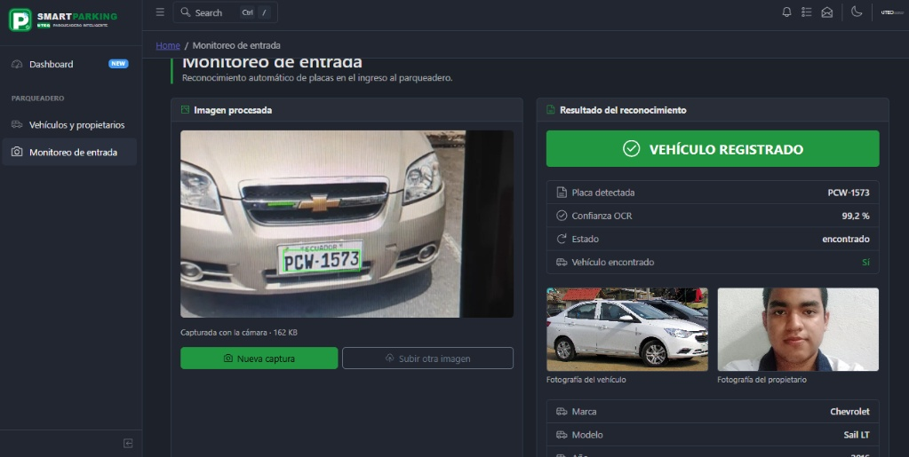

# UTEQ Smart Parking - Panel de Administración

Sistema web desarrollado para la gestión vehicular y monitoreo de accesos en el parqueadero de la **Universidad Técnica Estatal de Quevedo (UTEQ)**. Este proyecto extiende el panel administrativo base integrando reconocimiento automático de placas vehiculares (ALPR/ANPR) en tiempo real mediante visión artificial y consulta de registros en Supabase.

---

## 📌 Módulo: Monitoreo de Entrada

Vista desarrollada para el control de accesos vehiculares institucional (`/parqueadero/monitoreo-entrada`).



### Características principales:
* **Captura en Vivo:** Integración con la Web API `navigator.mediaDevices.getUserMedia()` con selección automática de la cámara trasera (`environment`) en terminales móviles.
* **Carga de Archivos:** Soporte alternativo para selección manual de fotografías en formatos `JPG` y `PNG` (máximo 4 MiB).
* **Consumo de Servicio OCR:** Envío binario (`application/octet-stream` / `Blob`) hacia Azure REST API para detección de matrícula.
* **Marcado Visual:** Visualización reactiva de la placa delimitada mediante un bounding box verde devuelto en Base64.
* **Consulta Automatizada en Supabase:** Validación inmediata del vehículo en la base de datos institucional:
  * **Vehículo Registrado:** Muestra datos técnicos, fotografía del vehículo, fotografía del propietario, cédula enmascarada y badge de autorización.
  * **Vehículo No Registrado:** Alerta visual de bloqueo que impide el acceso vehicular.
* **Manejo de Errores y Estados:** Control de casos límite como baja confianza, múltiples placas, ausencia de placa y códigos de estado HTTP (400, 413, 415, 502, 504).

---

## 🛠️ Tecnologías Utilizadas

* **Frontend:** React 18 + Vite
* **UI Toolkit:** CoreUI for React
* **Estilos:** Bootstrap / SCSS
* **OCR & Backend:** Azure Functions REST API
* **Base de Datos:** Supabase (PostgreSQL)
* **Despliegue & CI/CD:** Azure Static Web Apps + GitHub Actions

---

## ⚙️ Configuración del Entorno Local

1. **Clonar el repositorio:**
   ```bash
   git clone https://github.com/alexanderG116/SmartParkingUTEQ-PanelAdministracion.git
   cd SmartParkingUTEQ-PanelAdministracion